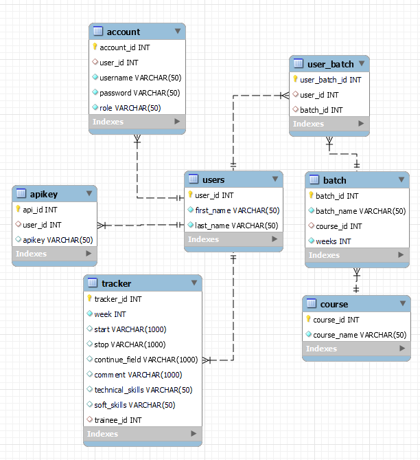

# Tech 202 Final Project: 
## Web APP and REST API Project for a 1-2-1 Weekly Tracker 
By Tech202:
Jade, Gloria, Nicole, Mary, Parmita, Verona

## Description 
> This project is a Web App that allows Spartan Trainees a method of logging and viewing their weekly self-reflection trackers. Spartan Trainers will also be able to easily view their teams of trainees trackers as well as access an API functionality to download, upload and edit the trainee members in their cohort. 
## How to use 
### Web App
1. Run the Spring program (TraineeTrackerApplication.java) on your machine 
2. In your browser, use endpoint -> http://localhost:8080/login to navigate to the login page  
### API App
The API exposes three endpoints
1. Get all the trainees from a batch
   Get request to endpoint -> http://localhost:8080/api/trainees/{BatchName}

2. Get the tracker information for a particular trainee
   Get request to endpoint -> http://localhost:8080/api/tracker/{traineeid}

3. Add a new batch of trainees
   Post request to endpoint -> http://localhost:8080/api/addbatch
   
   Post request needs to have a Request body in the following format,
   ```
   {
    "courseName":"SDET",
    "batchName":"TECH204",
    "numOfWeeks":8,
    "trainerFirstName":"Laura",
    "trainerLastName":"Tozer",
    "newTrainees":[

                   {
                       "firstName":"Sorela",
                       "lastName":"Sokoli",
                       "userName":"sorela",
                       "password":"password",
                       "userRole":"trainee"
                 }       
    ]
}

### Technologies used
1. Springboot
2. ThymeLeaf
3. Spring Data JPA
4. MySQL
5. HTML/CSS & Bootstrap
7. Swagger
8. Postman

## ER Diagram
> Below is a diagram that describes our database structure which the APIs implement. Run the SQL scripts included in order to get the same database. 
> 
> 
